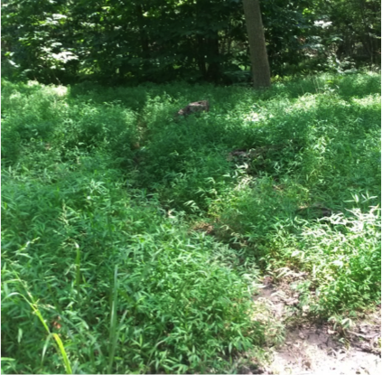
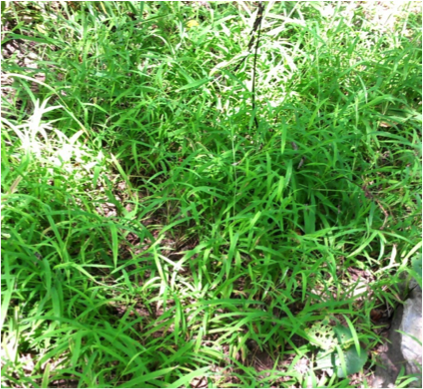

  
  

Invasive plants can dramatically alter ecosystem carbon (C) cycling. This effect is particularly concerning for forested ecosystems, which are primary regulators of atmospheric C concentrations. However, the impact that an invader has on ecosystem processes varies from site to site, making it difficult to generalize about the ecosystem-level effects of invasion.  Recently, researchers have hypothesized that the magnitude and direction of invasion effects may/ depend on the traits of the invader relative to the traits of the invaded community. Specifically, invasive species are predicted to have the greatest impact on an ecosystem when it is the most dissimilar from the native species.  This is referred to as the Novel Traits Hypothesis (NTH). To date, only a handful of studies have tested this hypothesis and no studies have examined whether the NTH may explain differential impacts of invasive species on soil C storage. Using soil samples collected in Indiana, we examined whether <i>Microstegium vimineum</i> had a differential impact on C cycling in arbuscular- and ectomycorrhizal-associated forest plots. We tested this for particulate organic carbon and mineral-associated carbon. We found the effects of <i>Microstegium vimineum</i> were limited to the upper level of the soil, and strongest in ectomycorrhizal-associated forest plots. 
 

