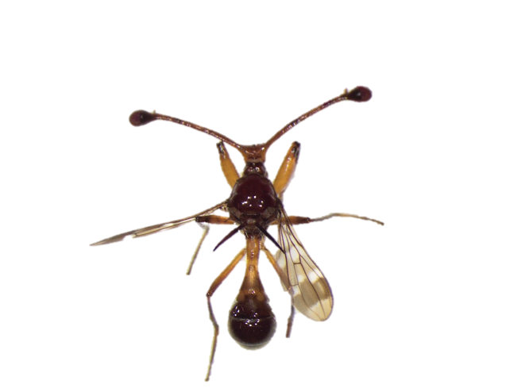
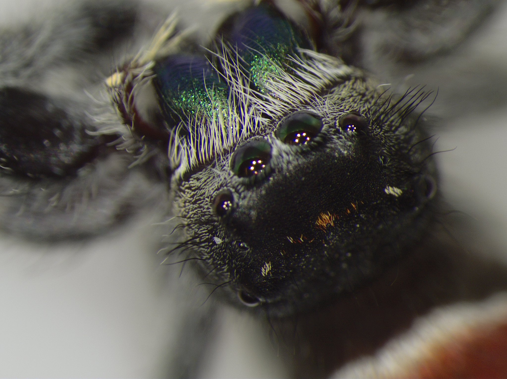
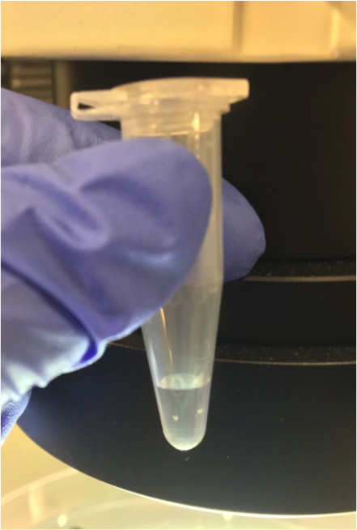
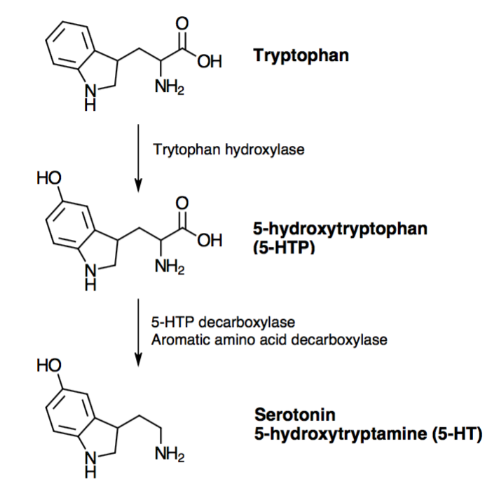

  
  
  
  

Aggressive behaviors have obvious fitness consequences across multiple levels of species interactions. Interspecific aggression affects survival rates during encounters with predators, while intraspecific aggression determines access to resources and mating opportunities. Despite the importance of aggressive outcomes on fitness, much is still unknown about the underlying mechanisms that contribute to aggressive behaviors. The biogenic amine serotonin modulates aggression and influences the outcomes of intrasexual competition. This project uses the stalk-eyed fly (Teleopsis dalmanni) to quantify the potential effects of elevated serotonin on fly aggression when facing a generalist predator. The effects of dietary supplementation of serotonin precursor (5-HTP) on antipredation behavior and individual survival were evaluated using forced proximity experiments with jumping spiders (Phidippus johnsoni). We found no differences in aggression between control males and females. Oral administration of serotonin precursor did not reliably elevate serotonin levels or result in changes in fly aggression or survival. Higher aggression levels were seen in trials in which the flies died, indicating that aggression towards the predator may not be beneficial. Topical methods of serotonin elevation seemed to be more effective at elevating serotonin than oral methods, however more research is necessary to fully understand the effects of elevated serotonin on stalk-eyed fly antipredation behavior. 
 

